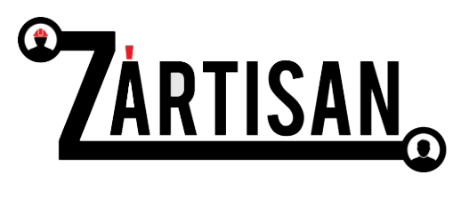
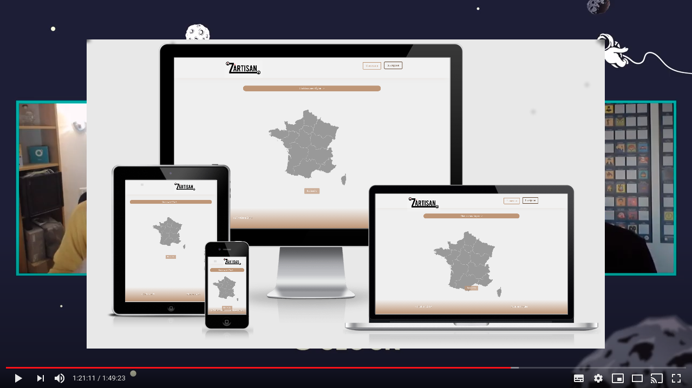

    

# ZartisanV2

      

# End-of-study project at O'Clock V2

## site for putting individuals in touch with local professionals.

**The site is in full mobile first. The registration of professionals is automated from 2 APIs (sirene and insee).**

#### &middot; Live View : https://zartisan.yj.fr

#### &middot; Présentation du projet (Vidéo démo Apothéose [O'clock](https://oclock.io/) Vortex 04/05/2020)

__Réalisation suivant méthodologie SCRUM :__ 4 sprints.

### Technology used on the front side

* React
* Redux
* Ant Design

### Technology used on the back side

* Symfony 4.3
* composer
* Bundle Easyadmin
* Bundle NelmioCorsBundle
* Bundle NelmioAlice
* Jwt Token
* API sirène
* API nomenclatures
* Swift Mailer

### Features in V2

* Default image for new  user.
* Creation folder and files images per user.
* Checking email and status for login.
